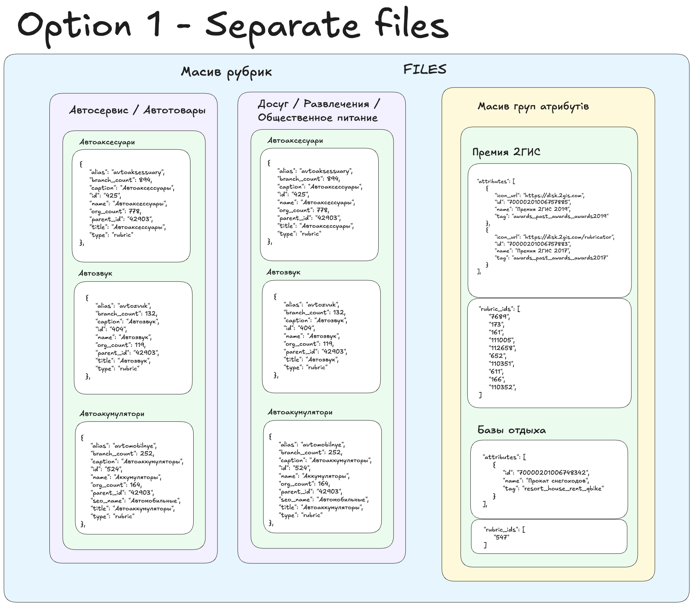
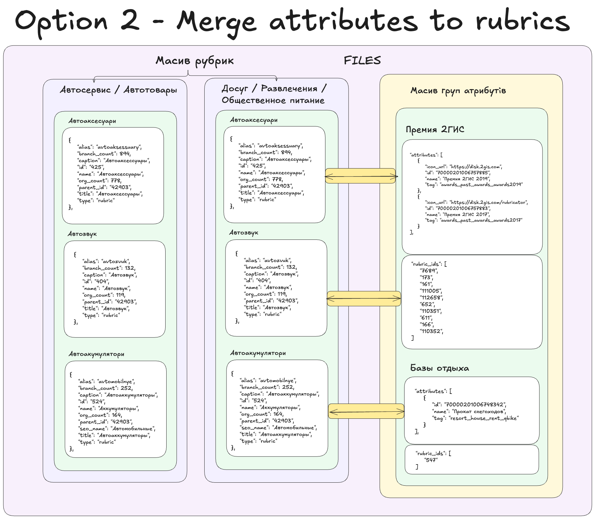

## 2Gis Parser Application

### Description

This application is designed to parse general rubrics, rubrics and their attributes from the 2gis API.
The application is written in TypeScript.

### Requirements

- 2gis API key's (free or paid)
- Proxy server (optional)

### Links

- [2gis Categories API](https://docs.2gis.com/ru/api/search/categories/overview)
- [Platform Manager (free API keys)](https://id.2gis.com/authorize?redirect_uri=https%3A%2F%2Fplatform.2gis.ru%2Fapi%2Fauth%2Fcode&client_id=E6A3wC4has1khQGA7LVNB2Ayox3ohQRr&response_type=code&state=eyJyZXR1cm5fdXJpIjoiaHR0cHM6Ly9wbGF0Zm9ybS4yZ2lzLnJ1L2VuL2tleXMiLCJjc3JmVG9rZW4iOiJmODdhZjA3NC1lMjA4LTQ2ODAtYjI4OC1lZjM3NGRiMjY2YTQifQ%253D%253D&scope=name+email+phone+avatar&code_challenge=NEhSy06PSKLR-a9vmAmMa5IxN6_jBWRDgTo7RxsnWqM&nonce=83a03ca7-eb2e-48b1-93d5-1e7375703671&country=ru_pro&locale=en&code_challenge_method=S256&stage=social&template=%2Fmailer%2F5922e75d69718a3b984bdbf7ba00edcb)

### TODO:

